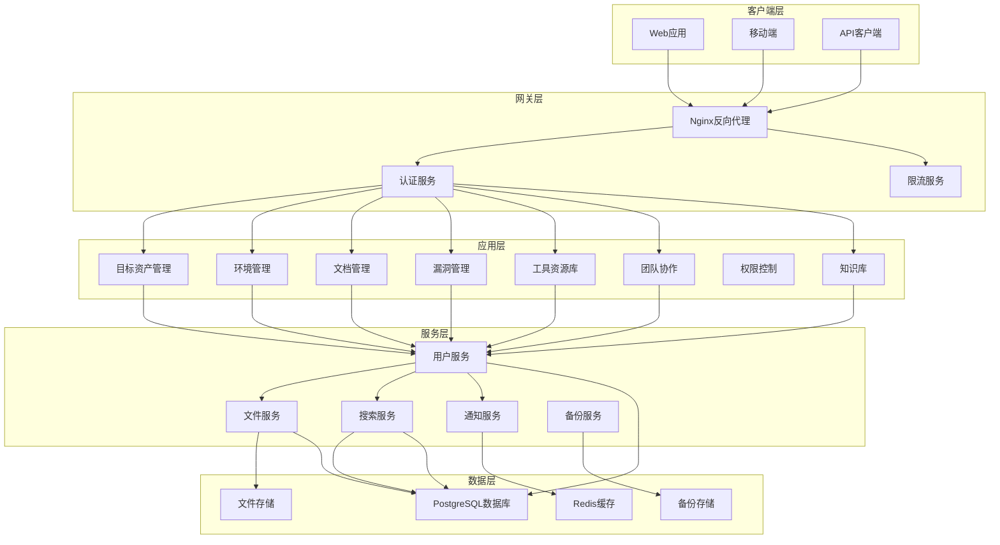
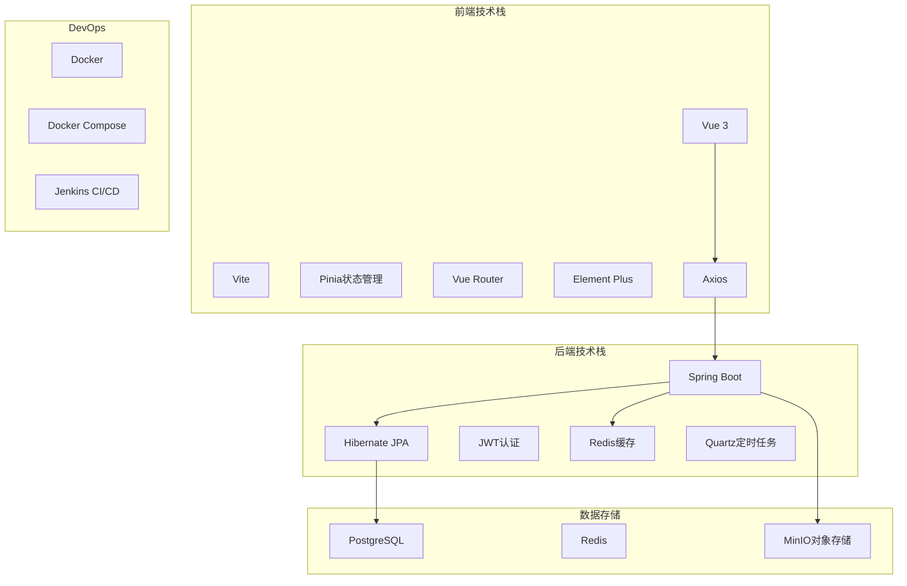
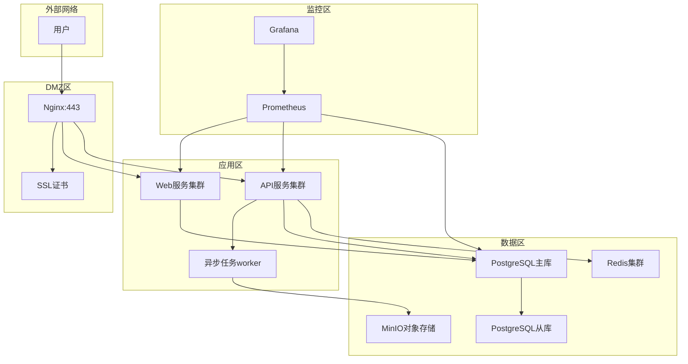
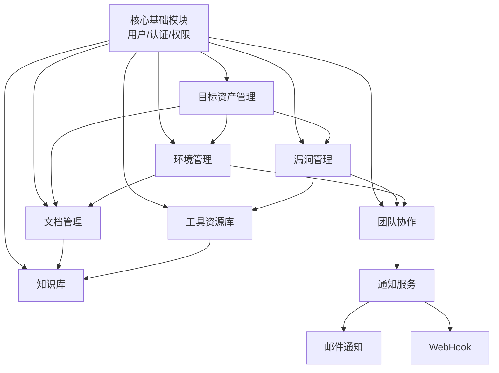
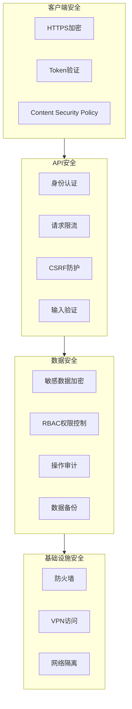

# 系统架构设计

## 1. 整体架构图

```mermaid
graph TB
    subgraph Client_Layer["客户端层"]
        Web["Web应用"]
        Mobile["移动端"]
        API_Client["API客户端"]
    end

    subgraph Gateway_Layer["网关层"]
        Nginx["Nginx反向代理"]
        Auth["认证服务"]
        Rate["限流服务"]
    end

    subgraph App_Layer["应用层"]
        Asset_Module["目标资产管理"]
        Env_Module["环境管理"]
        Doc_Module["文档管理"]
        Vuln_Module["漏洞管理"]
        Tool_Module["工具资源库"]
        Team_Module["团队协作"]
        Auth_Module["权限控制"]
        Knowledge_Module["知识库"]
    end

    subgraph Service_Layer["服务层"]
        User_Service["用户服务"]
        File_Service["文件服务"]
        Search_Service["搜索服务"]
        Notification_Service["通知服务"]
        Backup_Service["备份服务"]
    end

    subgraph Data_Layer["数据层"]
        PostgreSQL["PostgreSQL数据库"]
        Redis["Redis缓存"]
        File_Store["文件存储"]
        Backup_Store["备份存储"]
    end

    Web --> Nginx
    Mobile --> Nginx
    API_Client --> Nginx
    
    Nginx --> Auth
    Nginx --> Rate
    Auth --> Asset_Module
    Auth --> Env_Module
    Auth --> Doc_Module
    Auth --> Vuln_Module
    Auth --> Tool_Module
    Auth --> Team_Module
    Auth --> Knowledge_Module
    
    Asset_Module --> User_Service
    Env_Module --> User_Service
    Doc_Module --> User_Service
    Vuln_Module --> User_Service
    Tool_Module --> User_Service
    Team_Module --> User_Service
    Knowledge_Module --> User_Service
    
    User_Service --> File_Service
    User_Service --> Search_Service
    User_Service --> Notification_Service
    
    File_Service --> File_Store
    Search_Service --> PostgreSQL
    Notification_Service --> Redis
    Backup_Service --> Backup_Store
    
    User_Service --> PostgreSQL
    File_Service --> PostgreSQL
    Search_Service --> PostgreSQL
```

## 2. 技术架构图

```mermaid
graph TB
    subgraph Frontend["前端技术栈"]
        Vue3["Vue 3"]
        Vite["Vite"]
        Pinia["Pinia状态管理"]
        Router["Vue Router"]
        ElementPlus["Element Plus"]
        Axios["Axios"]
    end

    subgraph Backend["后端技术栈"]
        SpringBoot["Spring Boot"]
        Hibernate["Hibernate JPA"]
        JWT["JWT认证"]
        RedisCache["Redis缓存"]
        Quartz["Quartz定时任务"]
    end

    subgraph Database["数据存储"]
        PostgreSQL["PostgreSQL"]
        Redis["Redis"]
        MinIO["MinIO对象存储"]
    end

    subgraph DevOps["DevOps"]
        Docker["Docker"]
        DockerCompose["Docker Compose"]
        Jenkins["Jenkins CI/CD"]
    end
    
    Vue3 --> Axios
    Axios --> SpringBoot
    SpringBoot --> Hibernate
    Hibernate --> PostgreSQL
    SpringBoot --> RedisCache
    SpringBoot --> MinIO
```

## 3. 部署架构图

```mermaid
graph TB
    subgraph External["外部网络"]
        Users["用户"]
    end

    subgraph DMZ["DMZ区"]
        Nginx["Nginx:443"]
        Cert["SSL证书"]
    end

    subgraph App_Zone["应用区"]
        Web["Web服务集群"]
        API["API服务集群"]
        Worker["异步任务worker"]
    end

    subgraph Data_Zone["数据区"]
        MasterDB["PostgreSQL主库"]
        SlaveDB["PostgreSQL从库"]
        Cache["Redis集群"]
        ObjectStore["MinIO对象存储"]
    end

    subgraph Monitor["监控区"]
        Prometheus["Prometheus"]
        Grafana["Grafana"]
    end

    Users --> Nginx
    Nginx --> Cert
    Nginx --> Web
    Nginx --> API
    API --> Worker
    
    Web --> MasterDB
    API --> MasterDB
    MasterDB --> SlaveDB
    API --> Cache
    Worker --> ObjectStore
    
    Prometheus --> Web
    Prometheus --> API
    Prometheus --> MasterDB
    Grafana --> Prometheus
```

## 4. 模块依赖关系

```mermaid
graph TD
    Core["核心基础模块<br/>用户/认证/权限"] --> Asset["目标资产管理"]
    Core --> Env["环境管理"]
    Core --> Doc["文档管理"]
    Core --> Vuln["漏洞管理"]
    Core --> Tool["工具资源库"]
    Core --> Team["团队协作"]
    Core --> Knowledge["知识库"]
    
    Asset --> Env
    Asset --> Vuln
    Asset --> Doc
    
    Vuln --> Tool
    Vuln --> Team
    
    Env --> Doc
    Env --> Team
    
    Doc --> Knowledge
    Tool --> Knowledge
    
    Team --> Notification["通知服务"]
    Notification --> Email["邮件通知"]
    Notification --> WebHook["WebHook"]
```

## 5. 安全架构

```mermaid
graph TB
    subgraph Client["客户端安全"]
        HTTPS["HTTPS加密"]
        Token["Token验证"]
        CSP["Content Security Policy"]
    end

    subgraph API["API安全"]
        Auth["身份认证"]
        RateLimit["请求限流"]
        CSRF["CSRF防护"]
        InputVal["输入验证"]
    end

    subgraph Data["数据安全"]
        Encrypted["敏感数据加密"]
        RBAC["RBAC权限控制"]
        Audit["操作审计"]
        Backup["数据备份"]
    end

    subgraph Infrastructure["基础设施安全"]
        Firewall["防火墙"]
        VPN["VPN访问"]
        Isolation["网络隔离"]
    end
    
    Client --> API
    API --> Data
    Data --> Infrastructure
```
