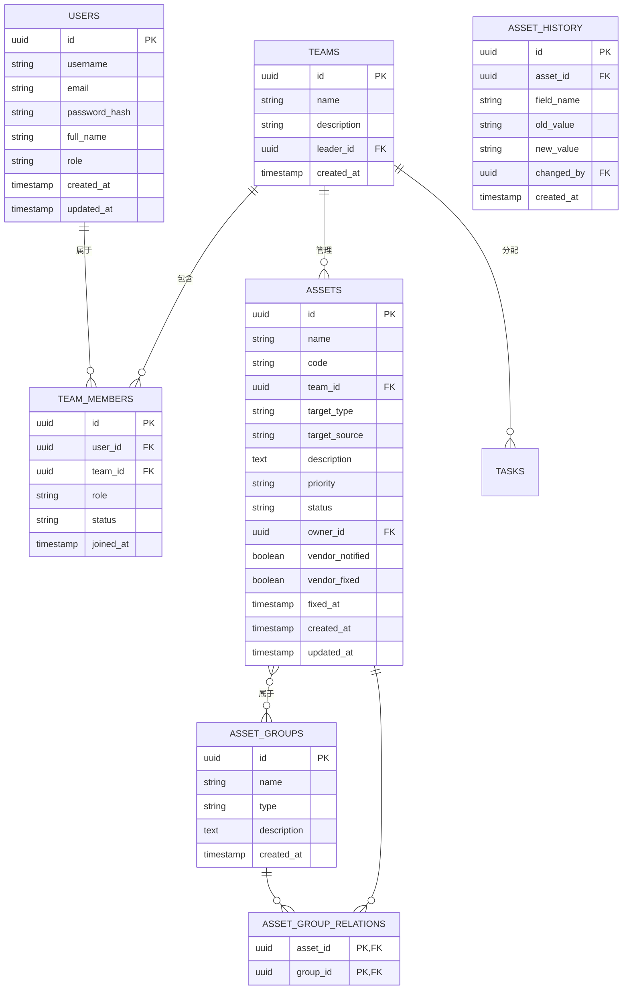
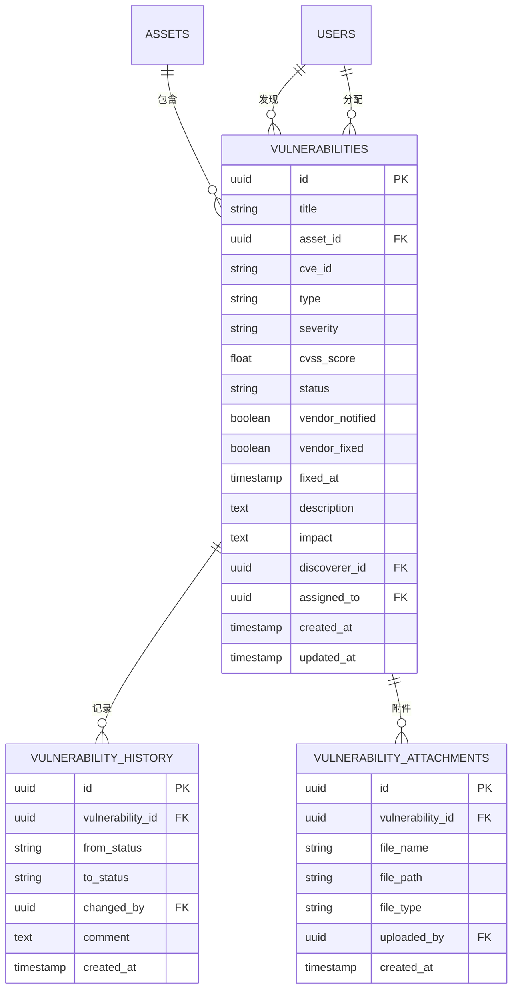
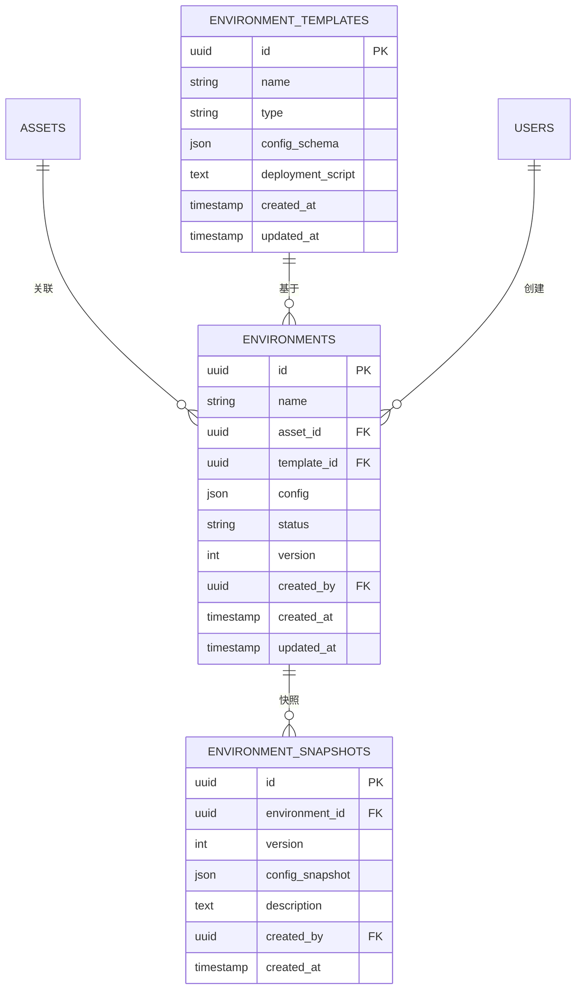
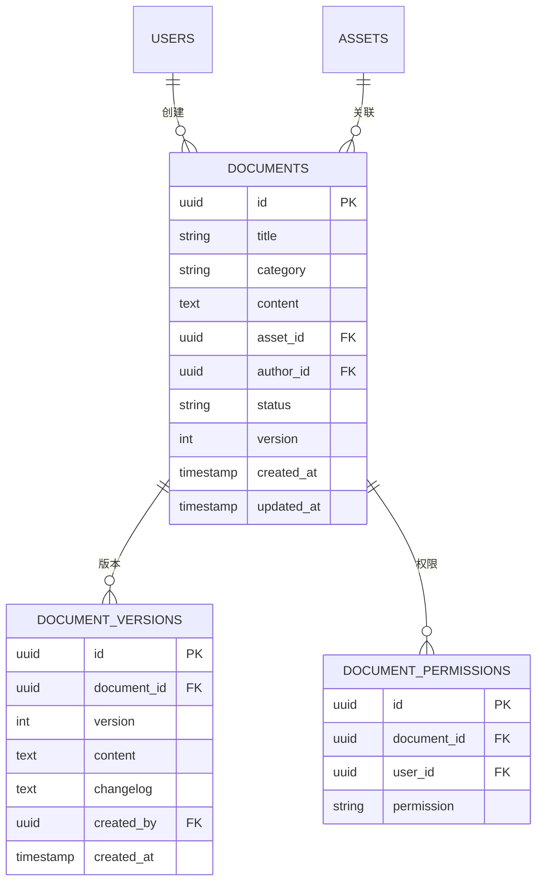
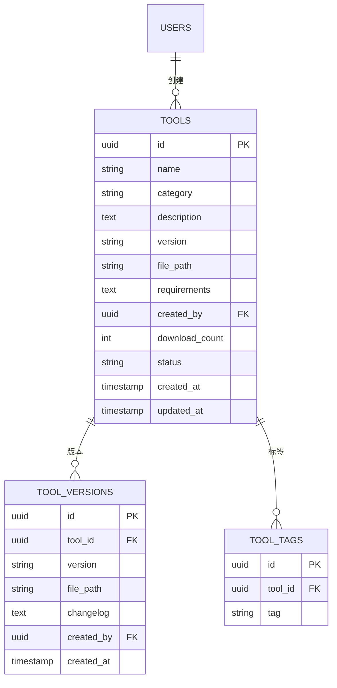
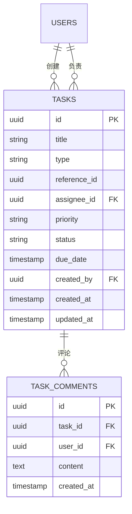
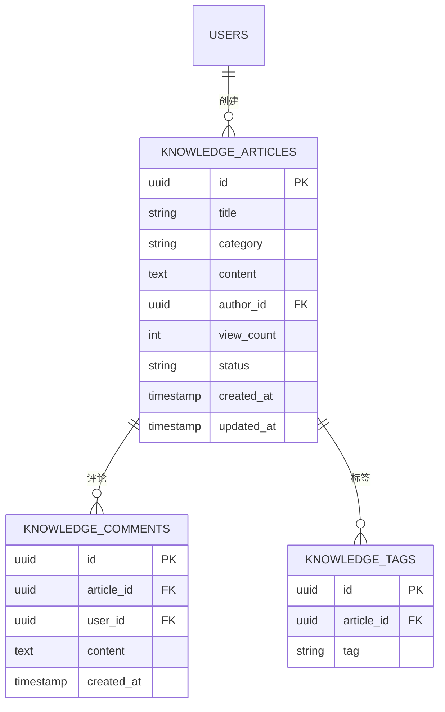
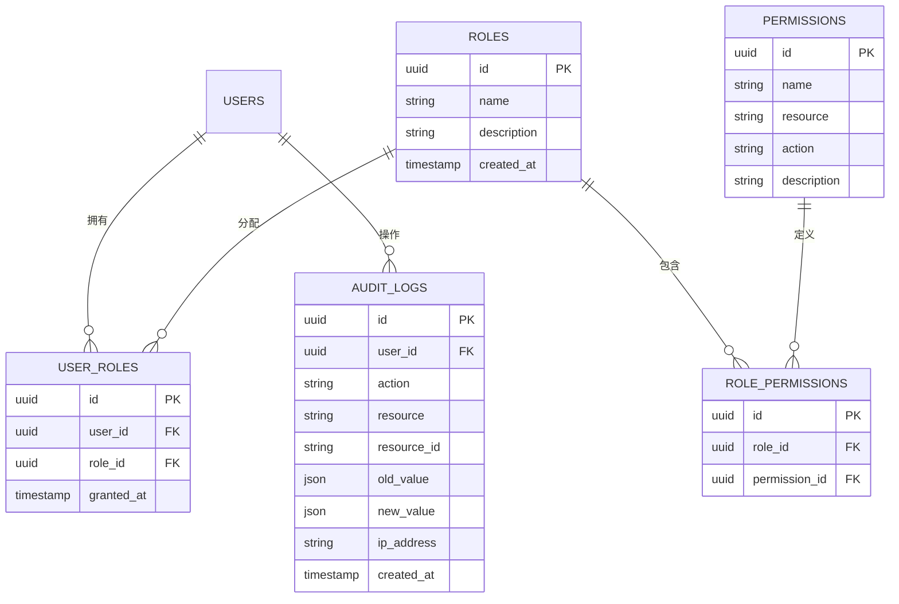
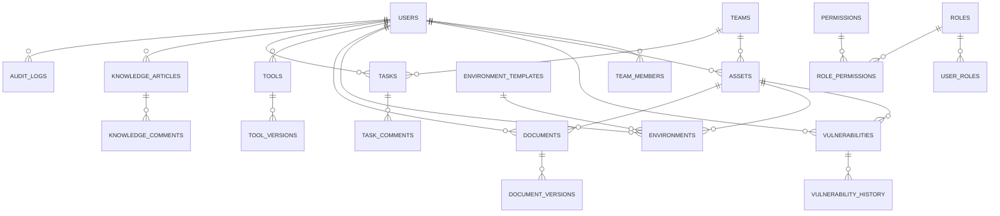

# 数据库ER图设计

## 1. 核心实体关系图

```mermaid
erDiagram
    USERS ||--o{ TEAM_MEMBERS : "属于"
    TEAMS ||--o{ TEAM_MEMBERS : "包含"
    TEAMS ||--o{ ASSETS : "管理"
    TEAMS ||--o{ TASKS : "分配"
    ASSETS }o--o{ ASSET_GROUPS : "属于"
    ASSET_GROUPS ||--o{ ASSET_GROUP_RELATIONS : ""
    ASSETS ||--o{ ASSET_GROUP_RELATIONS : ""
    
    USERS {
        uuid id PK
        string username
        string email
        string password_hash
        string full_name
        string role
        timestamp created_at
        timestamp updated_at
    }
    
    TEAMS {
        uuid id PK
        string name
        string description
        uuid leader_id FK
        timestamp created_at
    }
    
    TEAM_MEMBERS {
        uuid id PK
        uuid user_id FK
        uuid team_id FK
        string role
        string status
        timestamp joined_at
    }
    
    ASSETS {
        uuid id PK
        string name
        string code
        uuid team_id FK
        string target_type
        string target_source
        text description
        string priority
        string status
        uuid owner_id FK
        boolean vendor_notified
        boolean vendor_fixed
        timestamp fixed_at
        timestamp created_at
        timestamp updated_at
    }
    
    ASSET_GROUPS {
        uuid id PK
        string name
        string type
        text description
        timestamp created_at
    }
    
    ASSET_GROUP_RELATIONS {
        uuid asset_id PK,FK
        uuid group_id PK,FK
    }
    
    ASSET_HISTORY {
        uuid id PK
        uuid asset_id FK
        string field_name
        string old_value
        string new_value
        uuid changed_by FK
        timestamp created_at
    }
```

## 2. 漏洞管理实体关系

```mermaid
erDiagram
    ASSETS ||--o{ VULNERABILITIES : "包含"
    USERS ||--o{ VULNERABILITIES : "发现"
    USERS ||--o{ VULNERABILITIES : "分配"
    VULNERABILITIES ||--o{ VULNERABILITY_HISTORY : "记录"
    VULNERABILITIES ||--o{ VULNERABILITY_ATTACHMENTS : "附件"
    
    VULNERABILITIES {
        uuid id PK
        string title
        uuid asset_id FK
        string cve_id
        string type
        string severity
        float cvss_score
        string status
        boolean vendor_notified
        boolean vendor_fixed
        timestamp fixed_at
        text description
        text impact
        uuid discoverer_id FK
        uuid assigned_to FK
        timestamp created_at
        timestamp updated_at
    }
    
    VULNERABILITY_HISTORY {
        uuid id PK
        uuid vulnerability_id FK
        string from_status
        string to_status
        uuid changed_by FK
        text comment
        timestamp created_at
    }
    
    VULNERABILITY_ATTACHMENTS {
        uuid id PK
        uuid vulnerability_id FK
        string file_name
        string file_path
        string file_type
        uuid uploaded_by FK
        timestamp created_at
    }
```

## 3. 环境管理实体关系

```mermaid
erDiagram
    ASSETS ||--o{ ENVIRONMENTS : "关联"
    ENVIRONMENT_TEMPLATES ||--o{ ENVIRONMENTS : "基于"
    ENVIRONMENTS ||--o{ ENVIRONMENT_SNAPSHOTS : "快照"
    USERS ||--o{ ENVIRONMENTS : "创建"
    
    ENVIRONMENTS {
        uuid id PK
        string name
        uuid asset_id FK
        uuid template_id FK
        json config
        string status
        int version
        uuid created_by FK
        timestamp created_at
        timestamp updated_at
    }
    
    ENVIRONMENT_SNAPSHOTS {
        uuid id PK
        uuid environment_id FK
        int version
        json config_snapshot
        text description
        uuid created_by FK
        timestamp created_at
    }
    
    ENVIRONMENT_TEMPLATES {
        uuid id PK
        string name
        string type
        json config_schema
        text deployment_script
        timestamp created_at
        timestamp updated_at
    }
```

## 4. 文档管理实体关系

```mermaid
erDiagram
    USERS ||--o{ DOCUMENTS : "创建"
    ASSETS ||--o{ DOCUMENTS : "关联"
    DOCUMENTS ||--o{ DOCUMENT_VERSIONS : "版本"
    DOCUMENTS ||--o{ DOCUMENT_PERMISSIONS : "权限"
    
    DOCUMENTS {
        uuid id PK
        string title
        string category
        text content
        uuid asset_id FK
        uuid author_id FK
        string status
        int version
        timestamp created_at
        timestamp updated_at
    }
    
    DOCUMENT_VERSIONS {
        uuid id PK
        uuid document_id FK
        int version
        text content
        text changelog
        uuid created_by FK
        timestamp created_at
    }
    
    DOCUMENT_PERMISSIONS {
        uuid id PK
        uuid document_id FK
        uuid user_id FK
        string permission
    }
```

## 5. 工具资源库实体关系

```mermaid
erDiagram
    USERS ||--o{ TOOLS : "创建"
    TOOLS ||--o{ TOOL_VERSIONS : "版本"
    TOOLS ||--o{ TOOL_TAGS : "标签"
    
    TOOLS {
        uuid id PK
        string name
        string category
        text description
        string version
        string file_path
        text requirements
        uuid created_by FK
        int download_count
        string status
        timestamp created_at
        timestamp updated_at
    }
    
    TOOL_VERSIONS {
        uuid id PK
        uuid tool_id FK
        string version
        string file_path
        text changelog
        uuid created_by FK
        timestamp created_at
    }
    
    TOOL_TAGS {
        uuid id PK
        uuid tool_id FK
        string tag
    }
```

## 6. 任务管理实体关系

```mermaid
erDiagram
    USERS ||--o{ TASKS : "创建"
    USERS ||--o{ TASKS : "负责"
    TASKS ||--o{ TASK_COMMENTS : "评论"
    
    TASKS {
        uuid id PK
        string title
        string type
        uuid reference_id
        uuid assignee_id FK
        string priority
        string status
        timestamp due_date
        uuid created_by FK
        timestamp created_at
        timestamp updated_at
    }
    
    TASK_COMMENTS {
        uuid id PK
        uuid task_id FK
        uuid user_id FK
        text content
        timestamp created_at
    }
```

## 7. 知识库实体关系

```mermaid
erDiagram
    USERS ||--o{ KNOWLEDGE_ARTICLES : "创建"
    KNOWLEDGE_ARTICLES ||--o{ KNOWLEDGE_COMMENTS : "评论"
    KNOWLEDGE_ARTICLES ||--o{ KNOWLEDGE_TAGS : "标签"
    
    KNOWLEDGE_ARTICLES {
        uuid id PK
        string title
        string category
        text content
        uuid author_id FK
        int view_count
        string status
        timestamp created_at
        timestamp updated_at
    }
    
    KNOWLEDGE_COMMENTS {
        uuid id PK
        uuid article_id FK
        uuid user_id FK
        text content
        timestamp created_at
    }
    
    KNOWLEDGE_TAGS {
        uuid id PK
        uuid article_id FK
        string tag
    }
```

## 8. 权限控制实体关系

```mermaid
erDiagram
    USERS ||--o{ USER_ROLES : "拥有"
    ROLES ||--o{ USER_ROLES : "分配"
    ROLES ||--o{ ROLE_PERMISSIONS : "包含"
    PERMISSIONS ||--o{ ROLE_PERMISSIONS : "定义"
    USERS ||--o{ AUDIT_LOGS : "操作"
    
    ROLES {
        uuid id PK
        string name
        string description
        timestamp created_at
    }
    
    PERMISSIONS {
        uuid id PK
        string name
        string resource
        string action
        string description
    }
    
    USER_ROLES {
        uuid id PK
        uuid user_id FK
        uuid role_id FK
        timestamp granted_at
    }
    
    ROLE_PERMISSIONS {
        uuid id PK
        uuid role_id FK
        uuid permission_id FK
    }
    
    AUDIT_LOGS {
        uuid id PK
        uuid user_id FK
        string action
        string resource
        string resource_id
        json old_value
        json new_value
        string ip_address
        timestamp created_at
    }
```

## 9. 完整ER图概览

```mermaid
erDiagram
    USERS ||--o{ TEAM_MEMBERS : ""
    USERS ||--o{ ASSETS : ""
    USERS ||--o{ VULNERABILITIES : ""
    USERS ||--o{ ENVIRONMENTS : ""
    USERS ||--o{ DOCUMENTS : ""
    USERS ||--o{ TOOLS : ""
    USERS ||--o{ TASKS : ""
    USERS ||--o{ KNOWLEDGE_ARTICLES : ""
    USERS ||--o{ AUDIT_LOGS : ""
    
    TEAMS ||--o{ ASSETS : ""
    TEAMS ||--o{ TASKS : ""
    
    ASSETS ||--o{ VULNERABILITIES : ""
    ASSETS ||--o{ ENVIRONMENTS : ""
    ASSETS ||--o{ DOCUMENTS : ""
    
    ENVIRONMENT_TEMPLATES ||--o{ ENVIRONMENTS : ""
    
    VULNERABILITIES ||--o{ VULNERABILITY_HISTORY : ""
    
    DOCUMENTS ||--o{ DOCUMENT_VERSIONS : ""
    
    TOOLS ||--o{ TOOL_VERSIONS : ""
    
    TASKS ||--o{ TASK_COMMENTS : ""
    
    KNOWLEDGE_ARTICLES ||--o{ KNOWLEDGE_COMMENTS : ""
    
    ROLES ||--o{ USER_ROLES : ""
    ROLES ||--o{ ROLE_PERMISSIONS : ""
    PERMISSIONS ||--o{ ROLE_PERMISSIONS : ""
```
